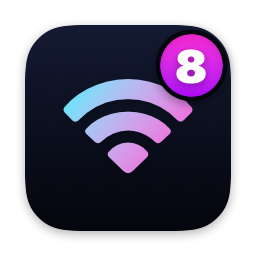
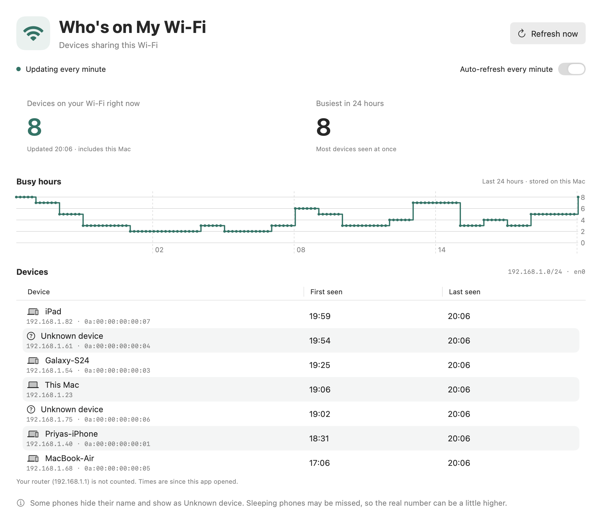
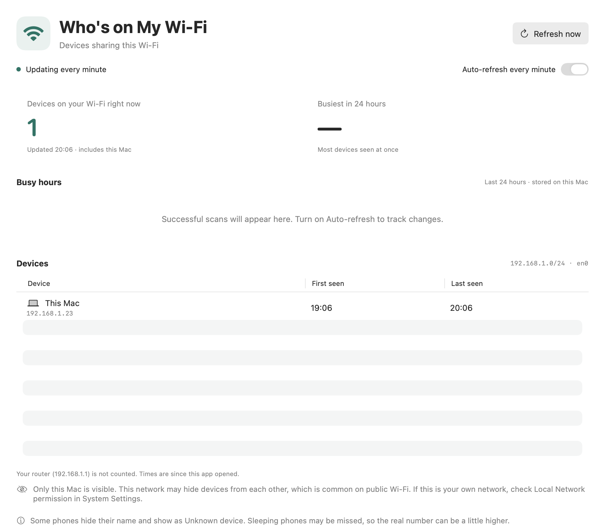

# Who's on My Wi-Fi

A tiny Mac app that shows how many devices are on your Wi-Fi, and what they're called. No router login, no account, no tracking.



## Install

1. Download **WhosOnMyWiFi.zip** from the [latest release](https://github.com/EtreResearch/whos-on-my-wifi/releases/latest) and unzip it.
2. Open the app once. macOS will block it because it isn't from the App Store. Choose **Done**.
3. Go to **System Settings → Privacy & Security**, click **Open Anyway**, enter your password, then click **Open**.
4. Allow **Local Network** access when asked.

macOS 13 or later, Apple Silicon or Intel.

## Use

Join a Wi-Fi network (turn off any VPN) and open the app. It updates every minute.

- **The number** is how many devices answered, including your Mac. Treat it as a minimum: sleeping phones can be missed.
- **Names** appear when a device shares one. Otherwise you'll see *Unknown device*.
- **Big networks:** only the 1,024 addresses nearest you are scanned, and the app says so.

### Public Wi-Fi

Most cafés, airports and hotels stop devices from seeing each other. There you'll only see your own Mac, and the app tells you why.



## Privacy

Device names and addresses stay in memory and disappear when you quit. Only counts over time are saved, for 24 hours, on your Mac. The app talks only to devices on your local network.

Please only scan networks you're allowed to use.

## Build from source

```sh
sh test.sh          # run the checks
sh build.sh         # build the app into build/
sh build.sh --zip   # also make the release zip
sh screenshots.sh   # redraw the screenshots (made-up data) and the app icon
```

Needs Apple's command-line tools (`xcode-select --install`). No other dependencies.

## License

[MIT](LICENSE) © 2026 Être Research
